# Class 2 In Class Lab
## Excel Lab 01 - Intro to Spreadsheets and Microsoft Excel

### Goal of Today's Lab

This lab is designed as an introduction -- or a refresher -- on the basics of spreadsheets using Microsoft Excel. It will walk through some best practices on working with data in spreadsheets.  It will cover sorting, and basic formulas, including percentage share and percent change.

### Step 1: Familiarization with the Excel interface

Open up Microsoft Excel.  

A window will pop up. Select "Blank Workbook", then click the "Create" button.

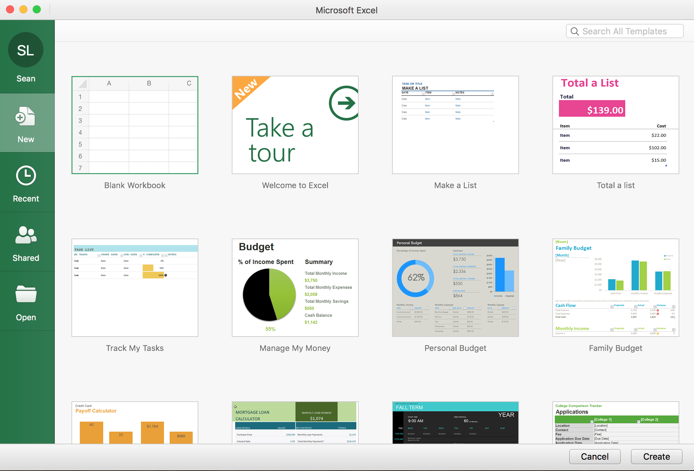

A blank spreadsheet will pop up.  This is the standard interface.  It has command shortcut icons across the top, with “smart menus” that change commands depending on what’s happening on the screen.

Review the image below.

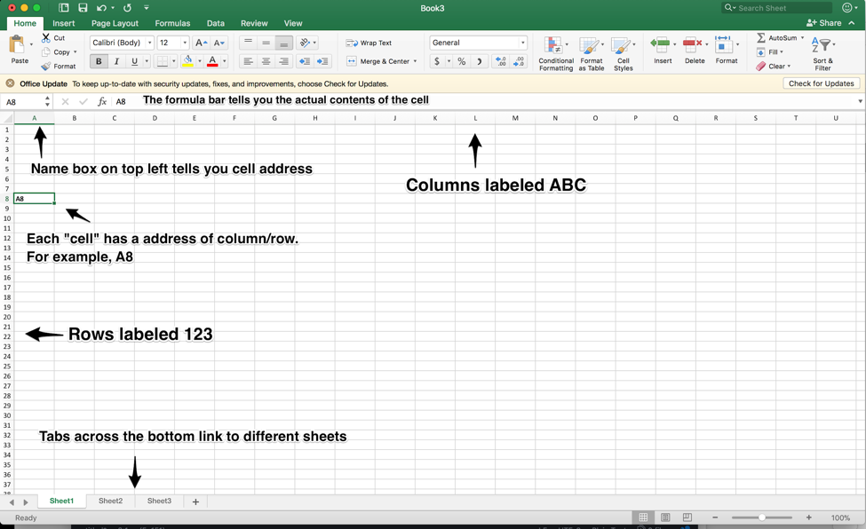

Type your name in cell A1 and hit enter.

### Step 2: Familiarization with Excel cursors

Close the spreadsheet you were just working with.  

Create a folder on your desktop called "excel-01". Download this [spreadsheet of U.S. federal government](data/_hist03z1-fy2019.xlsx) spending from 1940 to 2017, with estimates from 2018 through 2023. It was taken from the [Office of Management and Budget's data page](https://www.whitehouse.gov/omb/historical-tables/).

Move it into your "excel-01" folder, then open it in Excel.  

We'll dive into the content of this sheet in a moment.  

For now, let's familiarize ourselves with Excel's seven different mouse cursors, each with a different function. Don't make any changes to this sheet yet.

As you read down the list below, take some time to mouse over and select cells, to see the different cursors described below.

1. White Plus selects a cell or cells with left-mouse button.

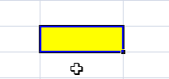

2. White Hand moves a cell or cells that have been selected.

3. Down-Point Black Arrow selects an entire column.

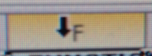

4. Right-Facing Black Arrow selects an entire row.

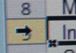

5. Black Cross is very important for copying and making a sequence.

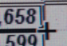

6. Double-Headed Arrow adjusts column width or row height. If a cell displays hash marks (####) instead of a value, the cell must be widened to show a large number or date.

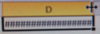

7. The Skinny-Line (Vertical) allows typing in a cell. When you click in a cell, the cursor resembles the flashing vertical line in a text editor.  

### Step 3: Key introductory steps to take when working with spreadsheets.

There are some key steps to take every time you work with a new spreadsheet.  Let's walk through those now.

**Add source information** -- Maintaining the source of the data is critical.  You'll need to know where you got your information to source it in a story, and to share with your editors.

A good way is to add a new worksheet, and input key information, including where and when you acquired it.

Do that now.  Click the plus button next to the "Table" sheet to add a new worksheet. Rename it "Source". In A1, add a column name "Date Downloaded", and in B1 add a column named "Source".

In cell A2, type "8/24/18". In cell B2, add this website: https://www.whitehouse.gov/omb/historical-tables/.

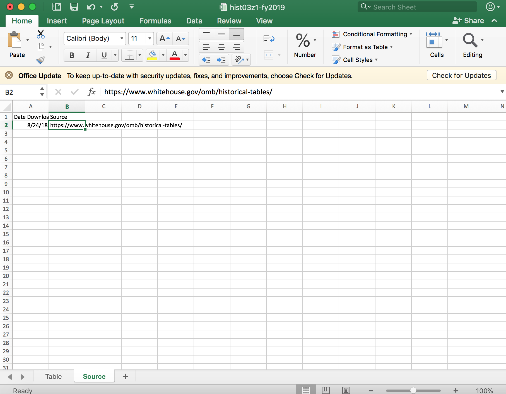

**Preserve the original document** -- It's critical to keep a clean, unchanged copy of the data to which you can refer back.  Even simple changes, like renaming columns, should not be done in the original. An easy method is to add v01 to the end of the file name, and save it as a new copy.

Do this now. Save the file as hist03z1-fy2019v01.xlsx into your "Excel-01" folder.

**Remove extraneous rows and information** -- Original data sets often come with extra header rows that can make it hard to filter data later on.  In this case, the first row, "Table 3.1...", needs to go. So does the third row.   

Do this now. Left click on the number 1 in the far left of the spreadsheet to select the row. Then, right click and select "Delete" from the dropdown menu. Repeat for the third row (which is now the second row).  If it helps you remember, you can add "in millions" to the new cell A1, so that it reads "Superfunction and Function (in millions $)".

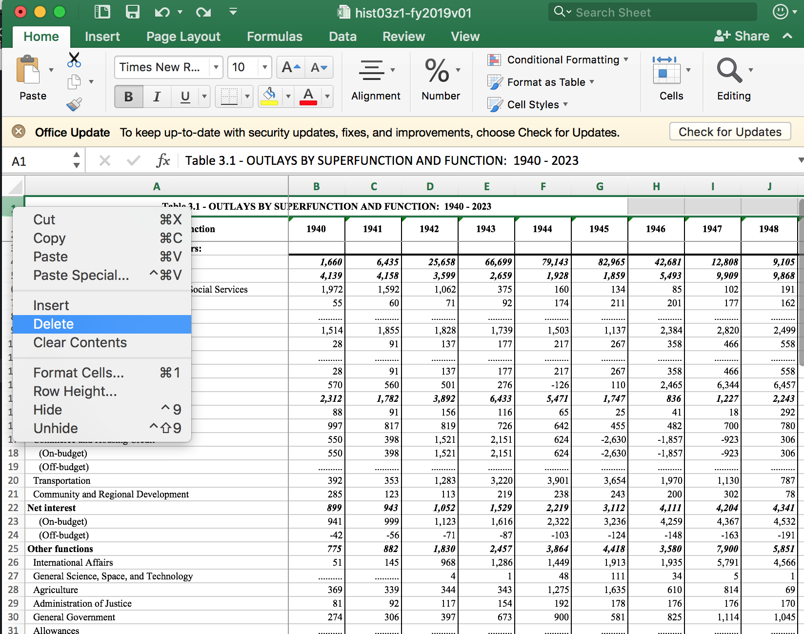

**Insert record numbers** -- In your working copy, it's a good idea to add a new column in the left-most position with a sequence of numbers (1, 2, 3...).  This will allow you to restore the data to the original sort order if you need to.  

Do this now.  Hover the mouse over cell A1.  Hold down control and right click to bring up a dropdown menu. Select "Insert." Select "Entire Column" and hit OK.

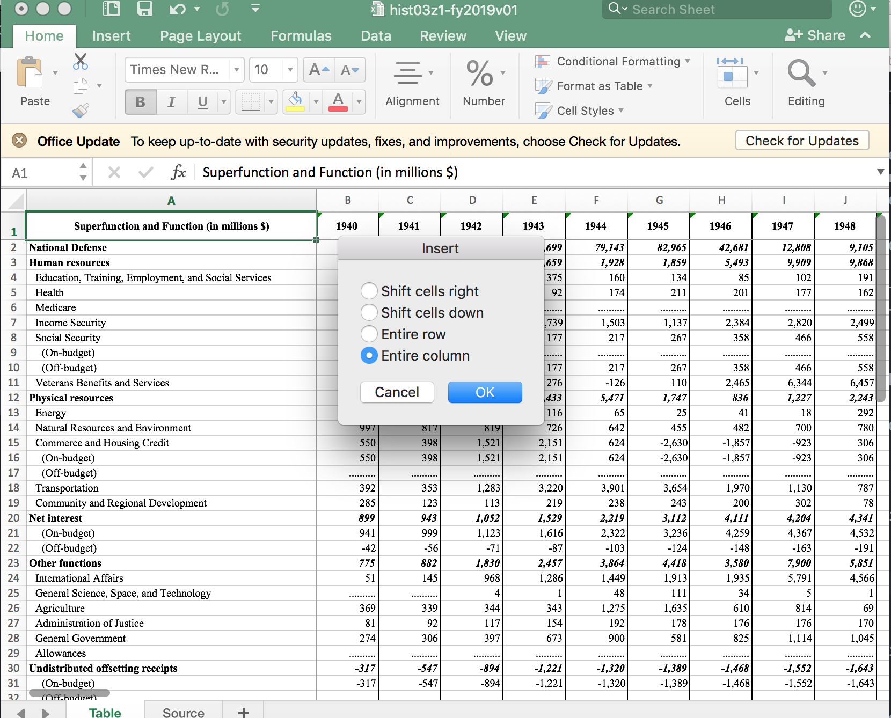

In cell A1, type "record_number."  Put the number 1 in A2, and the number 2 in A2.  

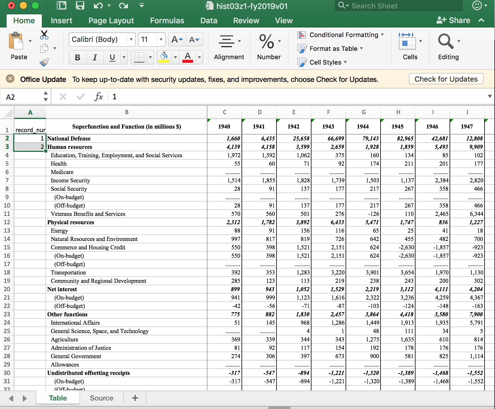

Click on cell A1. Hold down shift, and the down arrow to select cells A1 and A2. A small green square will appear at the bottom right corner of A2. Hover over it until the black cross appears. Click it and drag to the last row of data, row 56, and release the cursor.  A sequence of numbers from 1 to 55 now appears in column A, one number per row.

**Freeze the top row** -- It can be useful to "freeze" the top row (or rows) and left column (or columns) so that when you scroll down or across data sets with lots of records or many columns.

Do this now. Click on cell C2. In the menu at the top of your computer screen, select  Window > Freeze Panes.

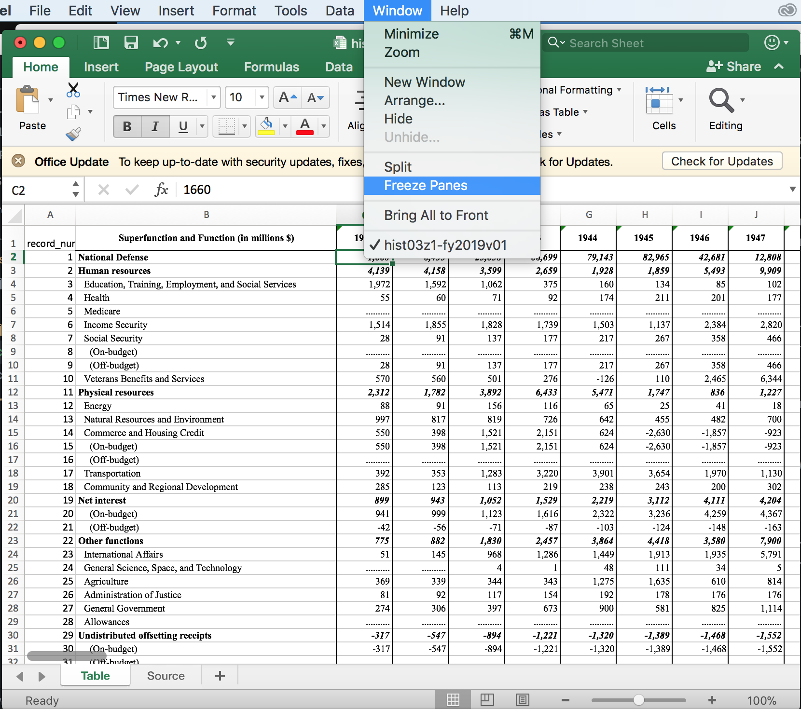

As you scroll down the page, and then across, notice that the the top rows (column headers) and left rows (row names and numbers), stay in place.

### Step 4: Computing new values with formulas... addition.

We can write a formula in a cell to calculate values -- totals, averages, percentage and more.

Unlike numbers, dates or text, formulas always begin with an equals (=) sign.     

Suppose we want to add up the total estimated spending on national defense for the years 2018 through 2023. Let's do this now.   

Click on cell CI1 and type "2018-2023 Total Estimate". In cell CJ2, add together all of the estimated values for national defense for the years 2018 through 2023, which are located in CD2, CE2, CF2, CG2, CH2 and CI2 by typing "=CD2+CE2+CF2+CG2+CH2+CI2".  

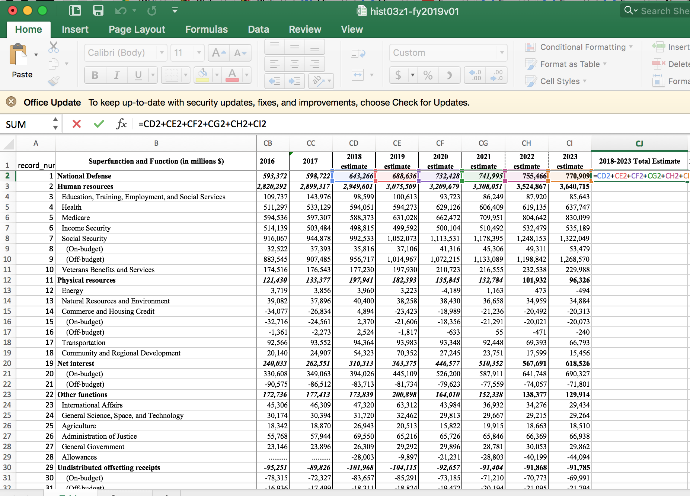

Notice that the formula appears in the cell and in the formula bar, too.  And notice that Excel automatically color codes the cells referenced in the formula. Use this to double-check your work; a mistaken formula can make a lot of trouble.

Suppose we want to calculate the 2018-2023 total estimated spending for each row in our spreadsheet.  

We could type the formula over and over again in each subsequent row.  But the beauty of Excel means we only have to type it once to automatically calculate it for more than one row.   

Let's do this now. Highlight cell CJ2. Hover the cursor over the bottom right corner to get the Black Cross copy tool. Click and drag down to CJ35 and release.

(It doesn't make sense to calculate sums on the rows below this. Can you figure out why?)

Doing this automatically adjusts the cells referenced in the formula to account for the fact that we've moved down rows.  This concept is called "relative addressing".

There are often several ways of writing a formula to achieve the same result.  

Click in cell CK1 and write "2018-2023 Total Estimated spending V2".  Instead of writing out each cell between 2018 (CD2) and 2023(CI2), write this "=SUM(CD2:CI2)".  

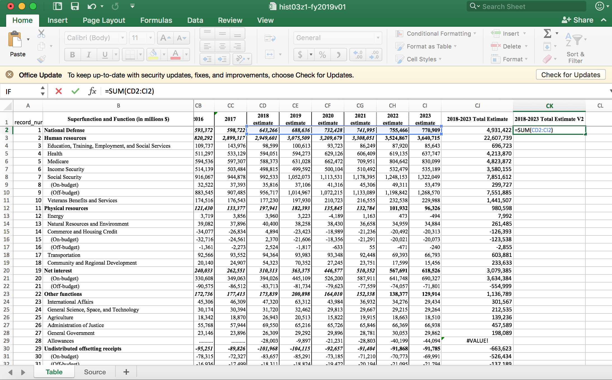

This uses the SUM function.  And inside of the parentheses, we put the cells we want to calculate totals on.  In this case, the colon says add up CD2, CI2 -- and everything in between. Use the same technique as above to fill the formula down to subsequent rows.

### Step 5: Computing new values with formulas... subtraction.

Let's answer another question with a formula. How much estimated spending is projected to change between 2018 and 2023.

In cell CI1, label the column “2018 to 2023 Change”.  In cell CI2, write a formula to subtract CI2 from CD2. A positive value will indicate growth from 2018 to 2023, a negative value a decline.  

See if you can work out the formula before looking at the image below.

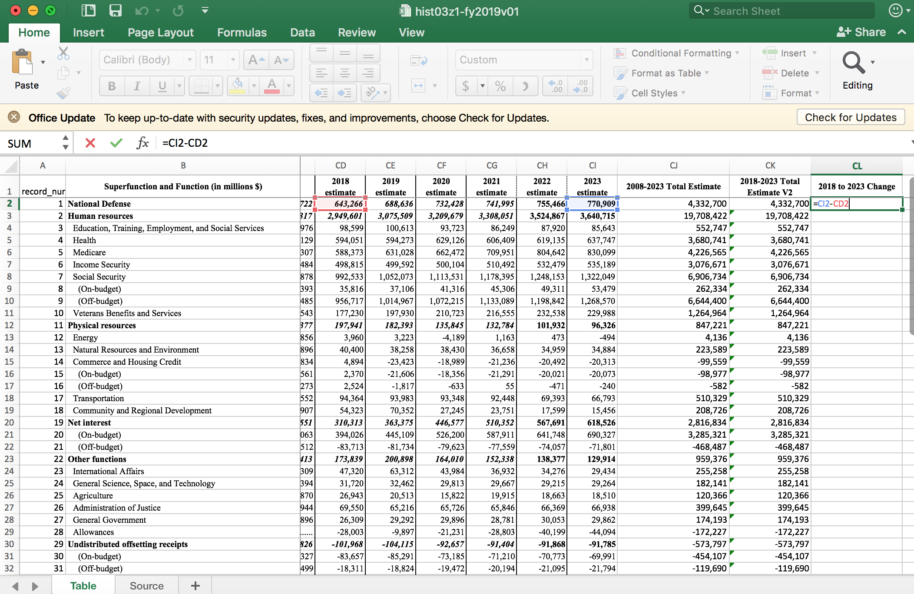

It's =CI2-CD2. Copy the formula down, as before.

### Step 5: Sorting

Rearrange a spreadsheet's rows is one of the most powerful was to gain insight from your data.  

Before we learn to sort, we're going to make our task easier by deleting the bottom 20 rows of the sheet, which contain percentage data on each budget category. Don't worry, they're preserved in our original sheet.

To delete rows 36 through 56, follow the instructions in Step 3.  Can you figure out how to delete more than one row at once?

This is not an ideal spreadsheet for sorting since it is set up with categories and subcategories, but it's good enough to learn the process.

In the upper left corner, click the gray triangle to select the entire sheet -- it should turn green.

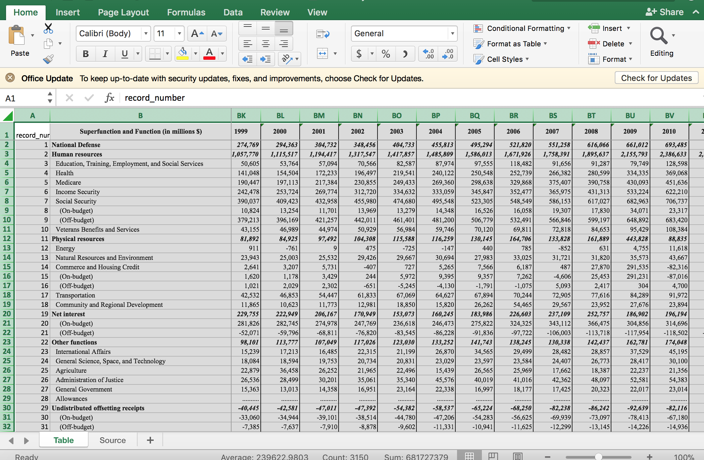

Select the "Data" tab at the top of the window, then click the "Sort Button". A pop-up window will appear.

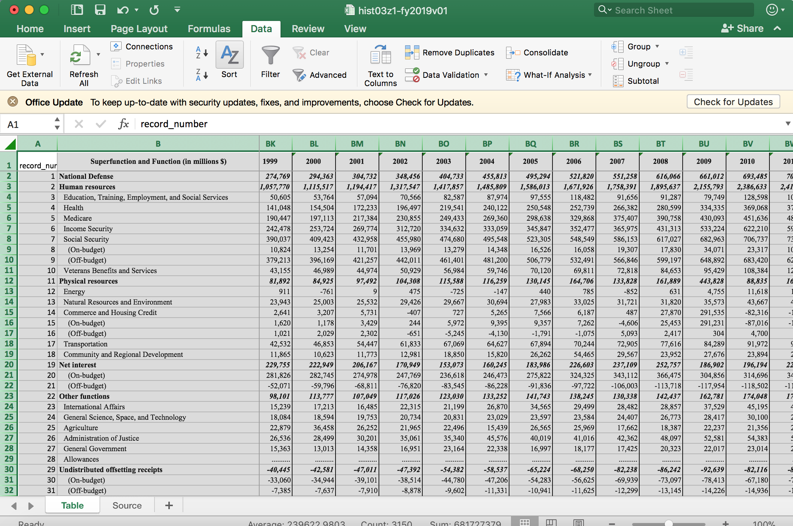

Click the "My list has headers" box in the upper right corner, select "2018 to 2023 Change" in the Column dropdown field, and order it Largest to Smallest (also known as descending). Then click "OK".

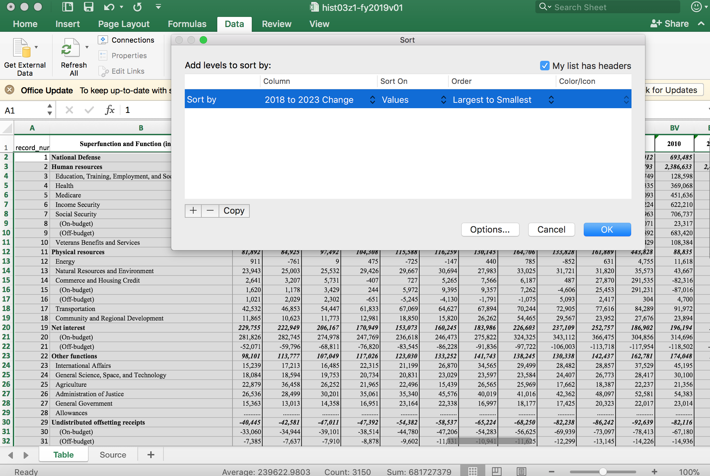

Scroll to the left and notice the categories have been rearranged from highest to lowest in the 2018 to 2023 change column.

On your own, can you figure out how to restore the original sort order?  Don't use the undo button!

Resort the sheet before moving to the next step.

### Step 6: Calculating Percent Change

We've calculated the raw number change between 2018 and 2023.  Now let's calculate the percent change for the same time span.

The formula we're writing is (New Value - Old Value)/Old Value. Or "new minus old, divided by old".

In column CM, create a header label "2018 to 2023 pct change".  In CM2, write the formula to calculate percent change.

* The "New Value" is 2023, in column CI
* The "Old Value" is 2018, in column CD

(New - Old)/Old = (CI2 - CD2)/CD2

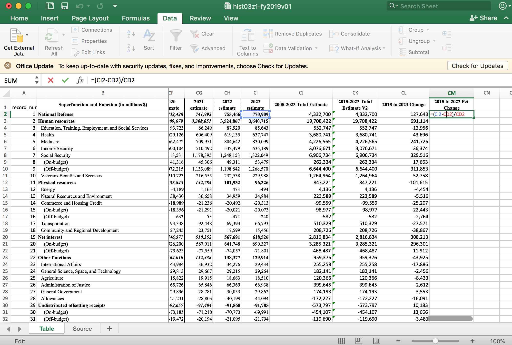

Notice that the result is a decimal.  Now let's format it to display as a percentage.  

Highlight cell CM2 by clicking into it.  In the menu bar, select "Format" > "Cells".

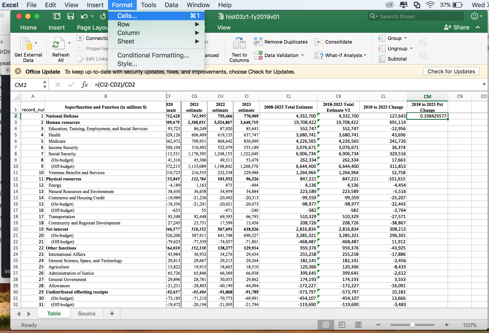

In the popup window, select "Percentage", and keep the decimal places at 2.  Then hit OK.

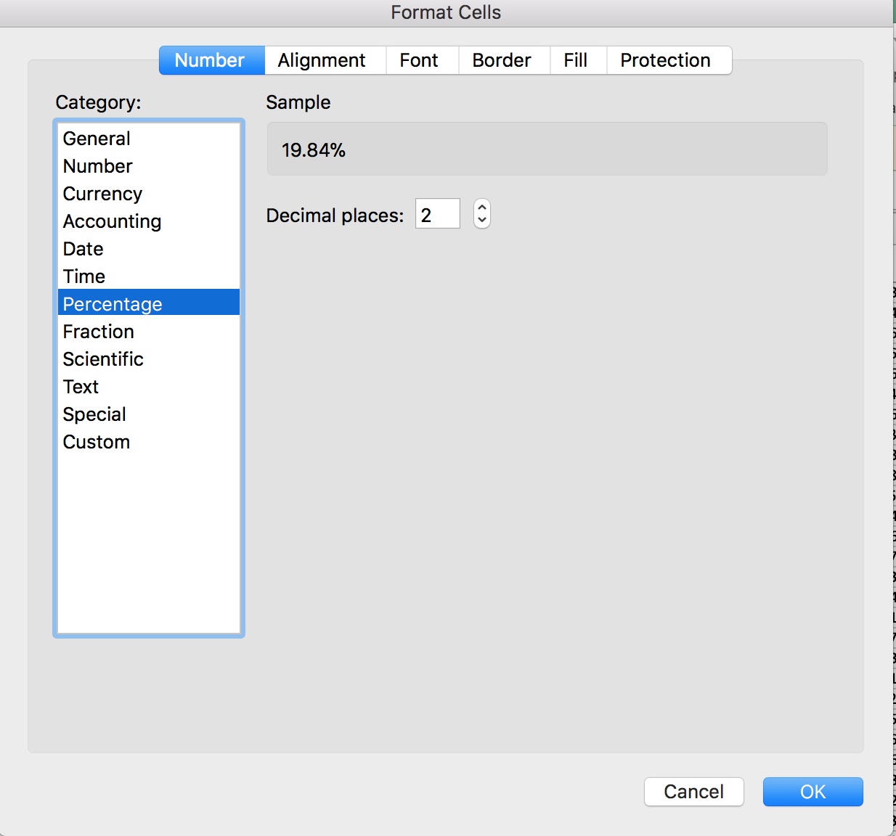

Now fill the formula down to compute percent change for every other row.

### Step 7: Calculating Share of Total

Now let's calculate the share, in percentage terms, each budget category accounts for of all federal spending. That total is in row 33, called "Total Federal Outlays".

Create a new column in CN, with a header in CN2 called "Share of Total Federal Outlays, 2023".

Input the formula, which is Sub-Category/Total or, in this case: =CI2/CI33

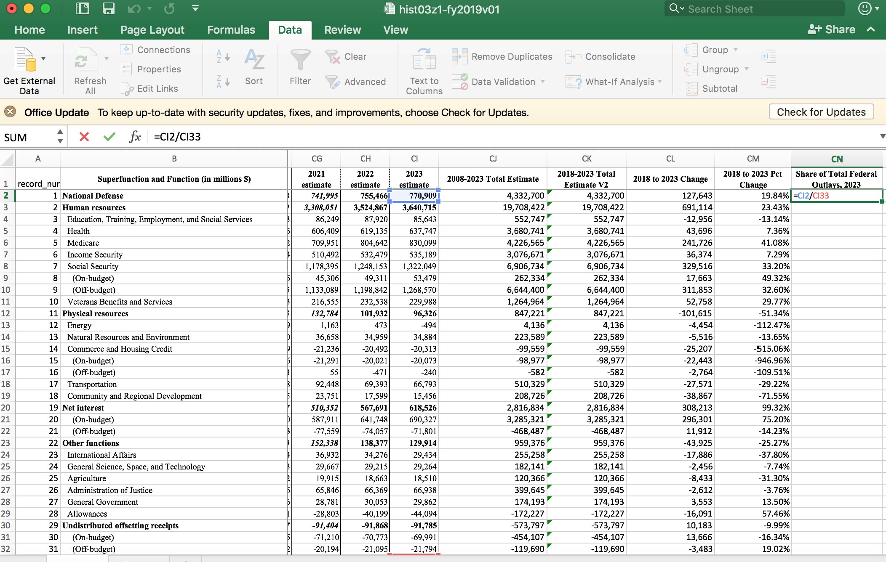.

Just as before, format the result as a percentage.

Before you drag the formula down to calculate the total for all other rows, just pull it down to the next cell below, CN3.  After it calculates, click into cell CN3 to have a look at the formula.

Notice that it's CI3/CI34.  That's a problem! CI3 is correct, but Our Total Federal Outlays value is in Cell CI33.  Excel thinks it's helping us, but it's really creating a logical error.  

Fortunately, there's a way to always refer to a specific cell as we copy down a formula, using the dollar sign ($).

Let's go back to our original formula in CN2 and modify it like so: =CI2/$CI$33.  The dollar signs say "as we copy the formula down, keep our total reference cell fixed on row CI33".  

### Step 7: Calculating Rank

Now let's calculate the rank of the sub category items under the "Human Resources" category for 2023 (column CI).

To calculate each sector’s rank in size, we use a function called, appropriately, RANK. It works like this. In cell CO4 type the formula =RANK(CI4, $CI$4:$CI$11)

Here’s what it says: find out how the value in cell CI4 ranks in size compared to the values in the cells from CI4 to CI11. The dollar signs add the instruction to keep that range of CI4 to CI11 constant as you copy the formula down to other cells.

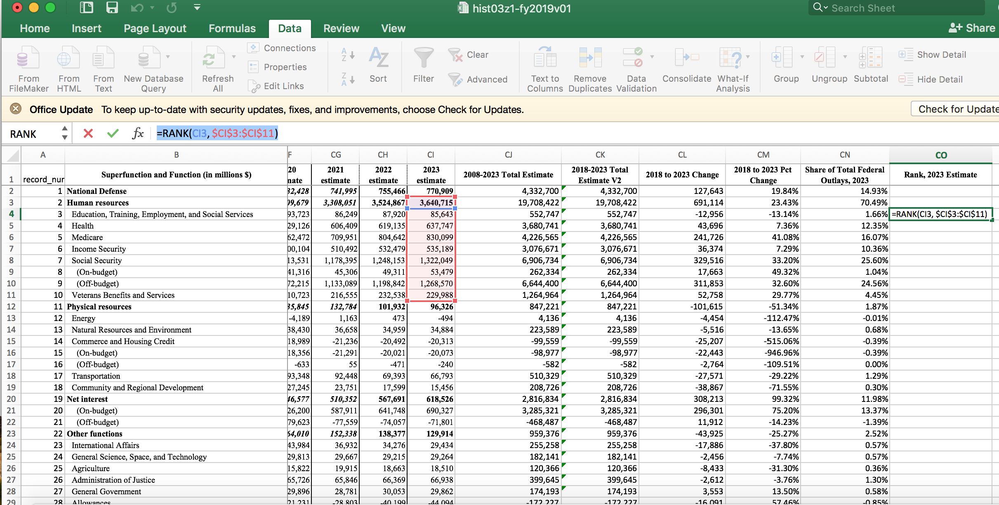.

Now drag the formula down to CO11.

### Step 8: All finished.  Turn it in.

You've completed the exercise.  Save your Excel file one last time. Then upload it to the [ELMS page](https://umd.instructure.com/courses/1251920/assignments/4695639) for this assignment.   

If you want to see a completed version of the spreadsheet, [download here](data/completed_hist03z1-fy2019.xlsx).
