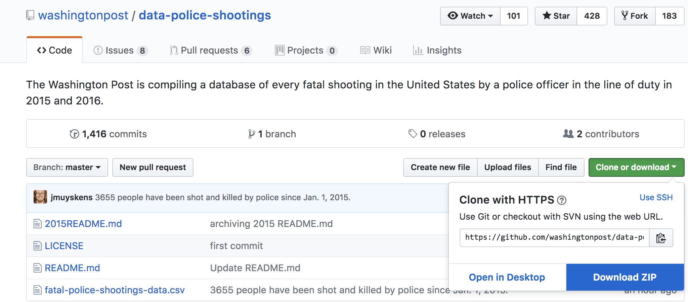

# Class 7 In-Class Lab
## Advanced Excel - Pivot Tables, Filtering, IF Functions

### Goal of Today's Lab
Today's lab is designed to introduce you to working with Open Data sets created by news organizations, making use of all the spreadsheet analysis skills you have learned previously -- Pivot Tables, filtering, functions, sorting and more.

Since 2015, The Washington Post has been collecting data about police shootings in the U.S. [Read more about this project](https://www.washingtonpost.com/graphics/2018/national/police-shootings-2018/?utm_term=.8fd2a67a7588). On the [GitHub repo for the project](https://github.com/washingtonpost/data-police-shootings), they make available a version of their dataset as a CSV. Documentation explaining the fields is also included there.  

Here's what the Post says about their collection methods:  

"In 2015, The Post began tracking more than a dozen details about each killing — including the race of the deceased, the circumstances of the shooting, whether the person was armed and whether the victim was experiencing a mental-health crisis — by culling local news reports, law enforcement websites and social media and by monitoring independent databases such as Killed by Police and Fatal Encounters. The Post conducted additional reporting in many cases."

### How to Submit

You will submit the edited Excel file that you create during the lab on the [ELMS page for this lab](https://umd.instructure.com/courses/1251920/assignments/4734989?module_item_id=9337425).  You will also submit a text file with the answers to the questions below on the same ELMS page.    

### Step 1: Get the updated data.

Go to the [GitHub repo for this project](https://github.com/washingtonpost/data-police-shootings).

Click the green "clone or download" button to pull up a small window, then click "Download Zip".  

Open the ZIP file and open fatal-police-shootings-data.csv in Excel.

**VERY IMPORTANT: Immediately SAVE AS the file as an .xlsx file.  Otherwise, you will lose all of the work you do in this lab, and have to do it again before doing the homework**.

### Step 2: Setup the Spreadsheet

Set up the spreadsheet as instructed previously.

1. Save a new copy to preserve the original data.
2. On the far left of the sheet, add a sequence column of consecutive numbers to allow you to return to the original sort order.
3. Freeze panes to make the column header row "sticky" as you scroll down.
4. Add a "source" tab, and link to the original source of the data.

### Step 3: Review the documentation

Go back to the [GitHub repo for this project](https://github.com/washingtonpost/data-police-shootings).  Read the README.md file to develop a better understanding of what's in it.

### Step 4: Analysis

Answer the following questions.  To do so, edit the spreadsheet as you see fit to derive the answers.

1. In what five states have the most police shootings occurred?
California, Texas, Florida, Arizona, Colorado.

2. Examining all shootings in the data set, what percentage of the time:
  * Was a body camera in use? 11 percent
  * Did a person display signs of mental illness? 24 percent.
  * Was the person armed? 82 percent. Note: created new column, classified everything as "armed" or "unarmed or undetermined". "Claimed to be armed" was classified as "armed", which was a judgment call.  
  * Armed with a gun? 56 percent this.  This included any record with "gun" in the armed column, but excluded bean-bag guns, nail guns, pellet guns and bb guns.

3. Looking at the data, identify the attributes of a person most likely to be shot by police. Examine gender, race, age, type of weapon, signs of mental illness, fleeing or not and anything else you find useful.

The typical shooter is male, white, between the age of 20 and 40, armed with a gun, without showing signs of mental illness. Most were not fleeing.

4. Create a new column in the spreadsheet called “Fleeing while black male?”.  Write a function in that column to indicate whether that particular record documents a case of a black male fleeing.  Use "Yes" if it is, "No" if it is not. Then use a filter to select only the "Yes" records.  Copy those records to a new worksheet.  Then create a pivot table to answer the following questions:
* How many total instances of this phenomenon are there? 319
* In which state did this happen the most? How many times?
California, 34.
* How many times was the person who was shot armed with a gun? 23
* How often did this person display signs of mental illness? 26
* How often was a body camera in use? 52

5.  Imagine it's the end of the year, and you've been assigned to write story about "the year in police shootings", with a focus on the racial breakdown of people killed in interactions with law enforcement.  What additional data would you want to gather to bring appropriate context to this story? How would you use it in concert with this database?
It would be helpful to know the racial breakdown of a given city/state/U.S. as a benchmark.  It would be helpful to know the race of the officer. There are plenty of other things, too.

6. Write a few sentences about the methods the Post uses to compile the database, answering these questions.  Where are they getting their information? What sources are they relying on?  Why is this superior to a single, official government source?

7.  Think of one question to ask of this data that hasn't been covered by the above questions.  Write the question, and the answer here.

### Step 5: Submit

Submit a text file with your answers, plus your edited spreadsheet, on the [ELMS page for this lab](https://umd.instructure.com/courses/1251920/assignments/4734989?module_item_id=9337425).
