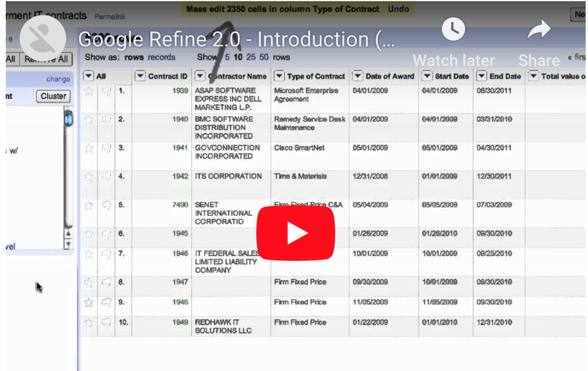

# Class 19 In Class Lab
## Data Cleaning

### Goal of Today's Lab

Today's lab will introduce you to a handy tool for data cleaning called OpenRefine.  

### Turning it in

After you finish, this tutorial post the csv file created as part of this lab to [this ELMS assignment](https://umd.instructure.com/courses/1251920/assignments/4759062).  

### Step 1: Install OpenRefine

OpenRefine is a tool that runs in your browser. You can download it at [OpenRefine.org](http://openrefine.org/). Download the latest release for your operating system.

Note: most of the tutorials we're working through were created for version 2.7.  The latest version, 3.0, is essentially the same, but there may be minor differences.

### Step 2: Watch this introductory video

This tutorial video will introduce you to how OpenRefine will walk through some of the basic functionality of the program.  It's a good intro.  

Later, if you choose, there are additional videos that will introduce you to some more advanced functionality here on the [OpenRefine site](http://openrefine.org/).   

### Step 3: Work through this tutorial

This [walkthrough tutorial](http://miriamposner.com/classes/dh101f17/tutorials-guides/data-manipulation/get-started-with-openrefine/) will guide you through the process of applying some basic cleaning techniques to a dirty data set.

Download [NJShipwrecks.xlsx](NJShipwrecks.xlsx), the data we'll be using for this tutorial. Follow steps 2 through 15, which will walk you through opening the program and uploading your data to exporting an edited csv.

### Step 4: Work through this tutorial

This [walkthrough tutorial](http://thomaspadilla.org/dataprep/) will give you additional practice with OpenRefine.  Download [authors-people.xlsx](authors-people.xlsx) as the data set to use with this tutorial.

### Step 5: Upload your CSV to ELMS.  
