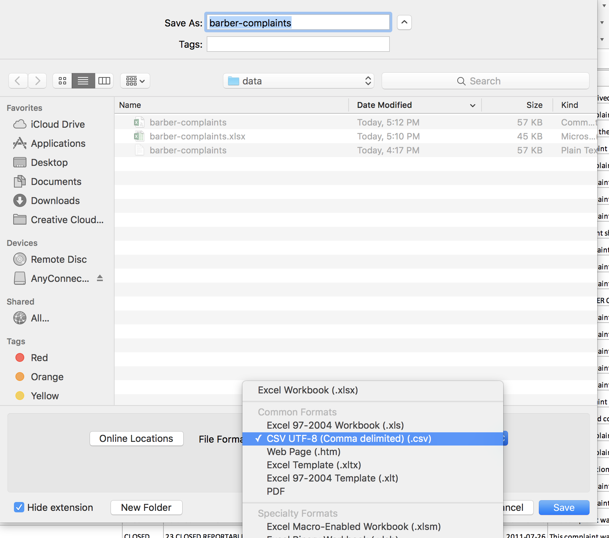

# Class 23 In Class Lab
## Loading Data | Getting data into MySQL workbench

### Goal of Today's Lab

Up to this point, we've been working with pre-existing databases in MySQL Workbench. That's great if your newsroom has a library of databases you can work with or if you have a connection to databases maintained by other organizations.  

But what if you have a table you want to analyze in Workbench that doesn't already exist?  For that, you need to know how to load data into Workbench using SQL scripts.

This assignment will introduce you to the process of creating a single table in an existing database, and uploading data to it.          

### Turning it in
After you finish, post your edited sql script to this [ELMS assignment](https://umd.instructure.com/courses/1251920/assignments/4762313).  

### Part 1: The Data

For the first parts of this assignment, we'll use a data set of complaints filed against Maryland barbers, maintained from the Maryland Board of Barbers.

Download the [data](data/barber-complaints.xlsx), contains one record per complaint.  

Open this file in Excel.  The first row contains field names.  

* COMPLAINT # - Unique identifier for the complaint. 	
* COMPLAINT SUMMARY	- Mostly blank, but includes some information about the complaint.
* O/C/I	- Whether the complaint is currently open, closed or being investigated.
* OVERALL STATUS - Status of the complaint.
* DATE COMPL RECD	- Date complaint was received.
* FINAL ACTION	- Final disposition of complaint. Mostly blank.
* FINAL CLOSE DATE	- Final date complaint was closed.
* FINAL COMMENTS	- Free text of complaint information.
* RESPONDENT FIRST NAME	- First name of person complaint against.
* RESPONDENT LAST NAME	- Last name of person complaint against.
* RESPONDENT CO NAMED	- Barber shop or other business name complaint against.
* RESPONDENT STREET	- Street of person complaint against.
* RESPONDENT CITY	-- City of person complaint against.
* RESPONDENT COUNTY	-- County  of person complaint against.
* RESPONDENT STATE	-- State  of person complaint against.
* RESPONDENT ZIP CODE -- Zip  of person complaint against.

Before we can upload to Workbench, we'll need to delete the first row of this spreadsheet, which contains the field names. Do that now.

Next, from the top menu, select File > Save As. Change the File Format from Excel Workbook.xlsx to CSV, Comma Separated Value (.txt). Save it to the desktop.



In a CSV, a comma is used to "delimit" or separate values in one cell from a value in another.  In a tab separated file, a tab character is used.  

### Part 2 - Open Workbench and Create a Table

Open Workbench and connect to the college's database server as you usually would.

We're going to upload our data as a temporary table as part of the FARS database.  

Write the command to use the FARS database.

```sql
USE fars;
```

Now we're going to create a temporary table called "barber 1", and define the columns or fields in that table.

Note that we are using different names than were used in our Excel file, because many of those names had spaces in them.  This complicates matters, so when we create the SQL table we're using field names without spaces.

Execute this command now. For each field, we have the name (i.e. caseno) and the datatype (i.e. varchar(20), or a datatype that accepts letters and numbers and stores them as a string that is up to 20 characters long). More on SQL datatypes [here](https://www.w3schools.com/sql/sql_datatypes.asp).   

```sql
CREATE TEMPORARY TABLE barber1
 (caseno varchar(20),
  summary varchar(100),
  open_close varchar(20),
  overall_status varchar(100),
  date_received date,
  final_action varchar(20),
  final_close_date date,
  final_comments varchar(260),
  name_first varchar(20),
  name_last varchar(50),
  name_company varchar(100),
  street varchar(50),
  city varchar(30),
  county varchar(2),
  state varchar(2),
  zip varchar(12)
  );
```

Let's take a look at the empty table we just created.  

``` sql
SELECT *
FROM barber1;
```

We should see field names, with no rows.

Just a note: if at any point you mess up and need to start over, you'll need to delete (or DROP) the barber1 table we've created. **You don't need to run this command now, it's just printed here in case you need it. Also: be very careful with DROP TABLE. You can easily destroy databases.**

``` sql
DROP TABLE barber1;
```
### Part 3 - Load Data

Now let's load the data in with another script.

Our file should be on the desktop.  Run this command below.  

```sql
LOAD DATA LOCAL INFILE  '~/Desktop/barber-complaints.csv'
INTO TABLE barber1
FIELDS TERMINATED BY ','
LINES TERMINATED BY '\r';
```

Let's look at the data.

``` sql
SELECT *
FROM barber1;
```

You should have 251 rows.

Did you get an error? Depending on your operating system, you may need to fiddle with the file path to get it right. On Windows it may be something like: "C:\Users\Public\Desktop\barber-complaints.csv".  

Another note: if you run this sql script and only get one record that imports, you may need to use one of the three scripts below, depending on your operating system and version of Excel.  

```sql
LOAD DATA LOCAL INFILE  '~/Desktop/barber-complaints.csv'
INTO TABLE barber1
FIELDS TERMINATED BY ','
LINES TERMINATED BY '\n';
```
OR

```sql
LOAD DATA LOCAL INFILE  '~/Desktop/barber-complaints.csv'
INTO TABLE barber1
FIELDS TERMINATED BY ','
LINES TERMINATED BY '\n\r';
```
OR

```sql
LOAD DATA LOCAL INFILE  '~/Desktop/barber-complaints.csv'
INTO TABLE barber1
FIELDS TERMINATED BY ','
LINES TERMINATED BY '\r\n';
```

Let's breakdown what this does line by line.

```sql
LOAD DATA LOCAL INFILE '~/Desktop/barber-complaints.csv'
INTO TABLE barber1
```

This tells workbench to get the data from the CSV file on our desktop and put it into the newly created table.

```sql
FIELDS TERMINATED BY ','
LINES TERMINATED BY '\r';
```

This tells us sql how to read the data.  

FIELDS TERMINATED BY ',' tells us that each cell is separated from the cell next to it by a comma, or comma delimited.  If our file was "tab" delimited, we'd use FIELDS TERMINATED BY '\t', which is the  hidden character the computer creates when we hit the tab key. If our file was delimited by a pipe | we'd use FIELDS TERMINATED BY '|'.

LINES TERMINATED BY '\r' indicates that each row or line ends with the hidden character created by the return key, called a carriage return.  '\n' indicates that each row or line ends with the hidden character for a "new line".  Some CSVs use \r, some use \n and some use both.  

### Part 4 - On you own.

This is a [CSV file of city names](data/nearcitycsv.zip) related to the BARD database. You should right click the link and download it to your desktop, and open it in Excel to examine.

There are three fields in this table.  The first is the incorrect name of a city as listed in the "NearestCityTown" field of the accident table.  The second field is the corrected spelling of that city name. The third field is a count of the number of instances of that city name in the accident field.

Your mission is to upload this CSV as a temporary table to the BARD database. It could be useful as a lookup table to get the correct city name when querying the accident table.

You'll need to follow the same general steps above to:
* modify the CSV file as needed.
* write a script to create a temporary table called lkpnearcity with field names and character type.
* write a script to upload the data to your empty table properly.
* examine the table to make sure it imported correctly.

Here's a big hint.  The data will not load correctly if you follow the exact method in the previous example.  Take a look at "HAUGE, VA" to see the problem.

This is a much more typical occurrence when loading data. Unlike the example above, it won't usually work perfectly the first time.

Web research will help you find a solution to this problem. You may need to open the CSV in Atom and, possibly edit it. If you edit it, describe in your SQL file what edits you made.  You may also need to modify your import script.   

Before you [upload your file to ELMS](https://umd.instructure.com/courses/1251920/assignments/4762313), show me your solution.
